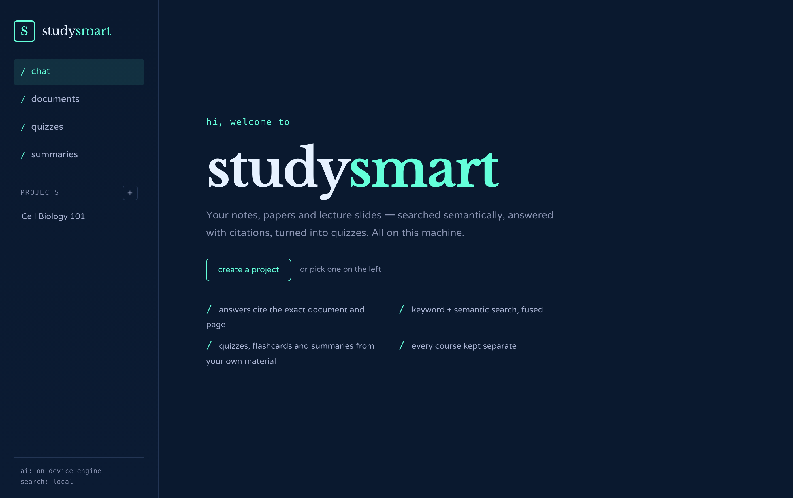
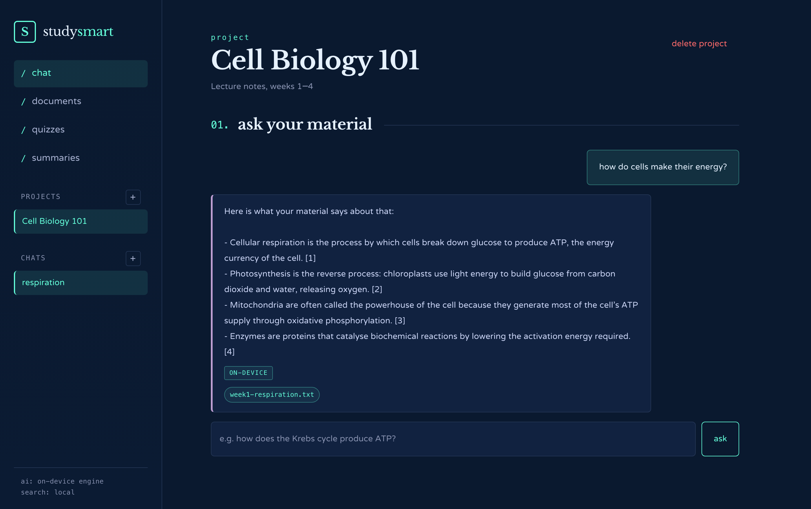
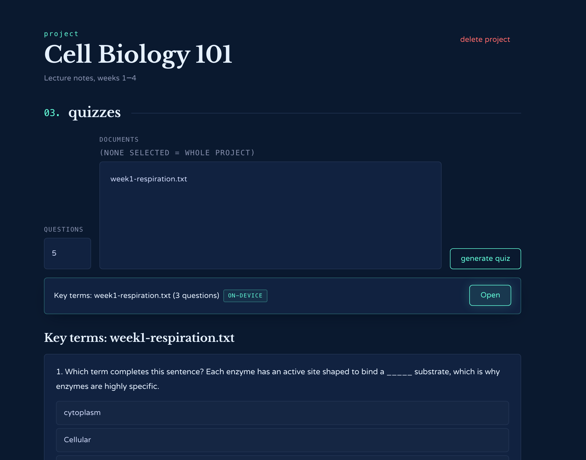
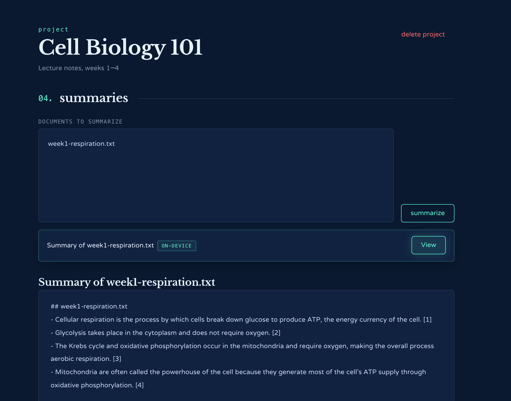

# StudySmart

[](https://github.com/Yousef-Alkheliwi/StudySmart/actions/workflows/ci.yml)


[](LICENSE)

A study assistant whose AI runs entirely on your machine. Upload lecture
notes, papers or PDFs into a project (one per course), ask questions and get
answers that cite the exact document and page they came from, generate
quizzes and flashcards from the material, summarize selected documents, and
keep every course's material, search index and conversation history
completely separate from every other course's.

StudySmart is not a wrapper around a chat API - there is no API. Retrieval,
semantic search, citation tracking and the answering, summarizing, quizzing
and grading engine are all implemented here, in Java, and your notes never
leave the computer. It works with the network unplugged.

## Quick start

```bash
git clone https://github.com/Yousef-Alkheliwi/StudySmart.git
cd StudySmart
./mvnw spring-boot:run        # needs Java 21; Maven is downloaded by the wrapper
```

Open <http://localhost:3939>, create a project, upload a PDF or notes file,
and ask it something. No API key, no account, nothing to sign up for.

## Screenshots

<p align="center">
  
</p>

| Grounded answers with citations | Quiz built from the material |
|---|---|
|  |  |

<details>
<summary>Summary view</summary>

</details>

## Features

- **Hybrid semantic search.** Every chunk is indexed two ways: BM25 keyword
  search (Apache Lucene) and a dense vector from a sentence-embedding model
  that runs locally through ONNX Runtime. Rankings are fused, so "how do
  cells make energy" finds the paragraph about ATP synthesis even though
  they share no words.
- **Q&A with real citations.** Every answer is traced back to a document,
  page and quoted sentence. The engine returns the most relevant sentences
  verbatim, so it cannot invent a fact.
- **Quizzes and flashcards** - multiple choice, short answer and cloze
  flashcards, each tagged with its source, built by blanking out the most
  salient term in definition-like sentences (TF-IDF).
- **Self-grading short answers**, checked lexically against the reference.
- **Summaries** of selected documents, grouped by document with a citation
  per sentence.
- **Per-course isolation.** Each project gets its own Lucene index and its
  own vector set on disk, not a filtered shared index.
- **Conversation history**, persisted per project with multiple sessions.
- **Async ingestion** with page-aware, paragraph-aware chunking; uploads
  return immediately and process in the background.

## Architecture

| Concern | Implementation |
|---|---|
| Text extraction | Apache PDFBox, page-by-page, so every chunk keeps its page number |
| Chunking | A word-count sliding window (`Chunker`) that snaps its cut points to paragraph breaks, with configurable overlap |
| Keyword search | Apache Lucene, BM25, one physical index per project |
| Semantic search | `all-MiniLM-L6-v2` sentence embeddings run locally via ONNX Runtime (Deep Java Library); vectors stored in SQLite, exact cosine scan per project (`VectorIndex`) |
| Ranking | Reciprocal Rank Fusion of the two result lists (`RankFusion`) |
| Answers | `ExtractiveAnswerEngine`: embeds candidate sentences, picks the closest to the question, removes near-duplicates, cites each |
| Summaries | `ExtractiveSummarizer`: Maximal Marginal Relevance against the material's centroid vector |
| Quizzes | `ClozeQuizGenerator`: TF-IDF term salience, definition-shaped sentence preference, distractors from other documents' key terms, round-robin across documents |
| Grading | `LexicalGrader`: normalization, containment, token-overlap threshold |
| Persistence | SQLite via plain JDBC (`JdbcTemplate`), explicit schema, foreign keys, cascading deletes |
| Async processing | Ingestion, embedding and a startup vector backfill run on a dedicated executor |

If a hashing-based fallback embedding ever appears in the status footer
("hashing"), it means the learned model could not be loaded (for instance,
first run with no network): search still works, lexically, and it will try
the real model again on the next start.

### Stack

- **Backend:** Java 21, Spring Boot 3 (Web, JDBC, Validation), Maven
- **Search:** Apache Lucene 9 (BM25) + ONNX Runtime embeddings (DJL)
- **PDF parsing:** Apache PDFBox 3
- **Database:** SQLite (file-based, zero setup)
- **Frontend:** a small dependency-free vanilla JS single-page app served by
  the same Spring Boot process - no separate build step

### Why these choices

- **On-device only.** A study tool should work on a train with no signal
  and without sending your notes anywhere. Everything the app promises -
  search, answers with citations, quizzes, summaries - runs locally, with
  no accounts, keys or usage costs.
- **Lucene + local embeddings over a hosted vector database.** Both run
  embedded with no accounts or network hops, and a physically separate
  index per project makes course isolation a structural property.
- **Extractive rather than generative.** A small local model that
  *writes* answers would hallucinate. Returning the material's own
  sentences, ranked semantically, is honest by construction - and every
  line comes with a citation for free.
- **SQLite.** Zero services to run. The single-writer limitation is handled
  explicitly (pool size 1, busy timeout) rather than papered over.

## Requirements

- **Java 21** (Temurin recommended): `brew install openjdk@21` on macOS, or
  [adoptium.net](https://adoptium.net).
- Maven is **not** required - `./mvnw` downloads it.
- Network access on the very first run, to fetch the embedding model
  (about 90 MB, cached under `data/models/`). Nothing is fetched after that.

## Running it

```bash
./mvnw spring-boot:run
```

Then open **http://localhost:3939**. The sidebar footer shows which
embedding model is powering search.

Standalone jar:

```bash
./mvnw -DskipTests package
java -jar target/studysmart.jar
```

Configuration is by environment variable (see `.env.example`):

| Variable | Default | Meaning |
|---|---|---|
| `STUDYSMART_EMBEDDINGS` | `local` | `local` (ONNX model), `hashing` (no download), or `off` (BM25 only) |
| `STUDYSMART_DATA_DIR` | `./data` | SQLite DB, uploads, Lucene indexes, vectors, cached model |
| `PORT` | `3939` | HTTP port |

## Using it

1. Create a project (top-left `+`), one per course or topic.
2. Upload PDFs, `.txt` or `.md` files in **Documents**. Status goes
   `PENDING` → `PROCESSING` → `READY` (or `FAILED` with a reason, e.g. a
   scanned PDF with no text layer).
3. Ask questions in **Chat**. Hover a citation chip to see the exact
   quoted text the answer rests on.
4. Generate a **Quiz** from all or selected documents; short answers are
   checked for you.
5. Generate a **Summary** of selected documents.

## API

All endpoints are under `/api`:

```
GET    /api/status                                  active embedding model
POST   /api/projects                                create a project
POST   /api/projects/{id}/documents                  upload a document (multipart)
POST   /api/projects/{id}/sessions                   start a chat session
POST   /api/sessions/{id}/ask                         ask a grounded question
POST   /api/projects/{id}/quizzes                    generate a quiz
POST   /api/quizzes/{id}/questions/{qId}/grade        grade a short answer
POST   /api/projects/{id}/summaries                  summarize documents
```

## Testing

```bash
./mvnw test
```

The suite exercises the actual algorithms, not just wiring: chunking
(sizes, paragraph snapping, exact overlap, offset round-tripping), a real
temp-directory Lucene index (ranking, project isolation, deletion), the
hashing embedding (determinism, unit length, relevance ordering), rank
fusion (agreement beats a single top rank; raw scores don't leak), the
vector index (ordering, cache invalidation), sentence splitting
(abbreviations, initials, hard-wrapped lines), the full on-device engine
(extractive answers with citations, de-duplication across overlapping
chunks, honest "not found", MMR summaries, cloze quizzes spread across
documents, lexical grading), and the HTTP layer via `MockMvc`.

## Project layout

```
src/main/java/com/studysmart/
├── domain/       records/enums - Project, StudyDocument, Chunk, Citation, Quiz, ...
├── repository/   JdbcTemplate persistence, one class per aggregate (+ chunk vectors)
├── ingest/       PDF/text extraction, chunking, async ingestion, vector backfill
├── embedding/    the EmbeddingModel abstraction: ONNX MiniLM, hashing fallback
├── search/       Lucene BM25, in-memory vector index, rank fusion, hybrid search
├── local/        the engine: extractive answers, summaries, cloze quizzes, grading
├── service/      use cases: projects, documents, chat, quizzes, summaries, grading
├── web/          REST controllers, DTOs, error handling
└── config/       Spring config, typed properties

src/main/resources/
├── schema.sql        SQLite schema
├── application.yml   configuration
└── static/           the frontend (index.html, app.js, styles.css)
```

## Known limitations

- Answers are extractive: they quote the material rather than explaining
  it in new words. That is deliberate - nothing is ever invented - but it
  means the app surfaces what your notes say, not a paraphrase of it.
- SQLite's single-writer model suits one user or a small group, not many
  concurrent writers.
- No auth/multi-tenancy; this is a local tool as built.
- Scanned/image-only PDFs fail ingestion with a clear error rather than
  falling back to OCR.

## Contributing

Issues and pull requests are welcome. Run `./mvnw verify` before opening a
PR - CI runs the same command on Java 21.

## License

[MIT](LICENSE)
